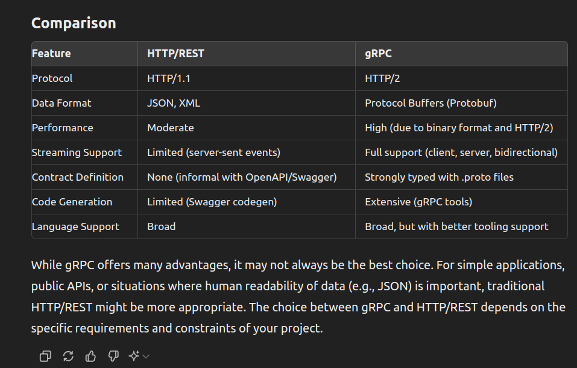
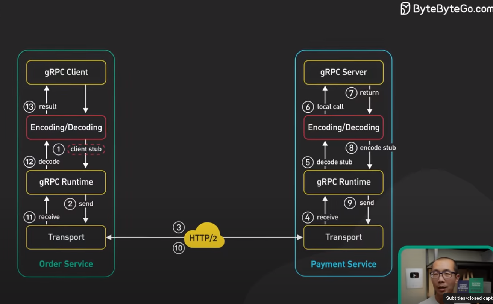

## This repo contains grpc client in java and python & grpc server in java.
- Blog: https://kaustubhdeokar.github.io/myblog/2024/06/05/grpc-101

### Background

#### Need for grpc ?

- SOAP, REST or GraphQL do not solve the problem of bidirectional communication.
- Any communication protocol needs client library to work. (When communication is done through the web, web browser is the client library)
- If the user uses any client library, it has to be maintained, which is not ideal.
  

#### Why to use it ?
- High performance - HTTP/2.
- gRPC uses Protocol Buffers for compact and fast serialization, ensuring efficient data exchange.
- Good support for various programming languages.
- gRPC simplifies implementing secure and scalable microservices. With built-in support for authentication, load balancing, and service discovery,
- Lastly, its rich ecosystem and active community provide extensive resources, tools, and ongoing improvements.


### How to implement it ?

you start with a proto file.

each language has library/plugin support to generate classes based on the proto file.
These classes are known as stubs.

Server side implements a service class which contains the actual business logic.
Client side - writes a client to invoke methods on server based upon it's local stub.

client and server communicate with each other through http 2.

### Working/Flow of grpc.
- 

### Setup
- Java 
  - find pom.xml containing needed java libraries.
  - maven clean install will generate the needed files.
- Python
```
pip install grpcio grpcio-tools
python -m grpc_tools.protoc -I. --python_out=. --grpc_python_out=. your_proto_file.proto
```
