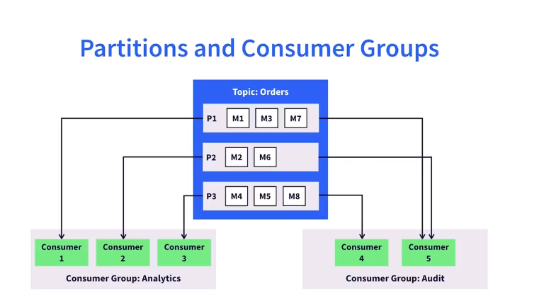
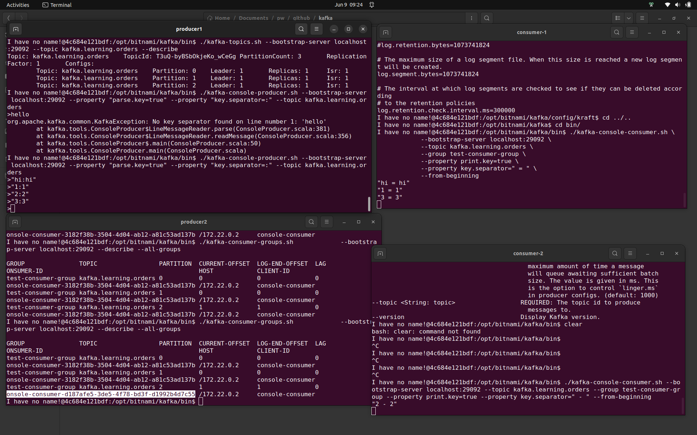
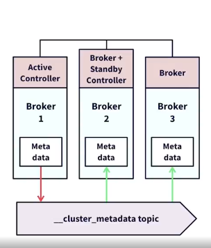
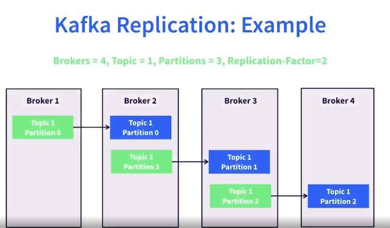

- This repo contains two spring boot applications
    - driver - publishing location updates to a topic: 'location'
    - user   - receiving updates from the topic: 'location'

- kafka-single-node.yml file will help setup a kafka broker on localhost.

Commands to setup a kafka broker:
> docker-compose -f kafka-single-node.yml up -d

An article describing kafka - broker, topics, consumers, producers, consumer groups, partition, failure handling in kafka from replications is described below:


# Kafka

Kafka is an events, message streaming platform.

### Messages
Each message each treated as a byte array.
max message size: max.message.bytes = 1MB, batching possible.
Message key:value -> key need not be unique, used for partitioning. (Also, key is optional)
Each message is timestamped.
Each message is stored in topic.


### Topics
- holds messages, (topic used to store similar message, identical structure).
- multiple topics supported in per kafka instance. 
- supports multiple producers and consumers.
- supports multiple partitions. Each message is stored in only one partition.

### Broker
- Kafka broker is the central piece between the producer and consumers.
- it is a running kafka instance, process executing on the OS.
- brokers controller everything, listening, receiving messages & stores.
- subscription management. Keep a heartbeat with every consumer.
- manage topics, partitions and logs. Takes care of replication of topics across multiple brokers.

Multiple kafka brokers form a kafka cluster - any one broker will act as the active controller for the broker. Each partition will have a specific broker as the leader.

### Logs
- managed by kafka brokers. 
- files are generated according to broker, topic, partition.

### Producers
- Takes care of key identification/generation. 
- Serialization to bytes upon an agreed contract with the consumer.
- Synchronous and asynchronous publishing options to the broker.

### Consumers
- consumers can consume at a later point of time also(streaming/batch)
- multiple concurrent consumers per topic.

> Topic creation:
```
  /kafka-topics.sh --bootstrap-server localhost:29092 --create --topic <name> --partitions 1 --replication-factor 1
```

> Topic description
```
  ./kafka-topics.sh \ --bootstrap-server localhost:29092 \ --list
```
> Producer
```
./kafka-console-producer.sh \ --bootstrap-server localhost:29092 \ --topic kafka.learning.tweets

- bootstrap-server <String: server to    REQUIRED unless --broker-list          
  connect to>                              (deprecated) is specified. The server
                                           (s) to connect to. The broker list   
                                           string in the form HOST1:PORT1,HOST2:
                                           PORT2. 
                                           
- topic <String: topic>                  REQUIRED: The topic id to produce      
                                           messages to.   
```
> Consumer
```
./kafka-console-consumer.sh \ --bootstrap-server localhost:29092 \ --topic kafka.learning.tweets --from-beginning
```
         
### Partitions
- Each partition has a leader broker.
- leader takes care of replicating the partition.
- each message goes to only one partition.

### Consumer groups - A group of consumers who share a topic workload
    - Each message goes to only one consumer in a group.
    - Consumer split the workload through partitions.
    - Each consumer groups get all the messages from a topic, but the messages are sent to only one consumer in that consumer group.



### Consumer offset management.
    - Number to track message consumption by consumer and partition.
    - Current offset: last message sent to a given consumer.
    - Committed offset: last message acknowledged by consumer.
    - **Resends message on timeout - ensures at least once delivery. (delivery can happen multiple times but will happen atleast once).**


Creating two consumers, belonging to the same consumer group: test-consumer-group, 
the partitions are split - where the deliver message to only one consumer in the consumer group.



- Each consumer group receives all the messages from the topic it is subscribed to 

## Kafka scaling.

### Overview
 
Resiliency with kafka ? 
- Storage failure
    - Replication
    - Mirroring - data from one cluster to other cluster.
- Broker failure
    - Active controller election
    - Topic leader election.
- Consumer failure
    - Offset tracking
    - Partition reassignments.

### Kafka Cluster:
- group of kafka brokers working together.
- each broker has a broker id, each node has a node id.


Kafka cluster 
    - a group of brokers.
    - brokers share work based on topic partitions.
    - metadata - info about clusters, topics and configurations, current status, consumer & consumer groups.
    - each node(broker) has a copy of the cluster metadata.
    - nodes in cluster can be either broker, controller or both - only one is the active controller.

Kafka controller
    - voting mech to choose the active broker.
    - active controller writes all metadata to __cluster_metadata topic.
    - other brokers and controllers read from this topic and update in-memory copies.


Kafka Replication
    - multiple copies of partition logs are maintained - to avoid broker failures.
    - unit of replication = partition. 
    - each partition has multiple replicas, set using replication factor.
    - there is a leader replica and follower replica(s).
    - leader replica is managed by the leader broker which manages writes reads and storage.
    - follower replicas are distributed to brokers, which are not leaders for same partition.
    - replication factors <= no. of brokers.



Kafka security
    - producer/consumer/broker auth using ssl/sasl 
    - authorization of read/write operations.

Kafka cluster setup. 
    - a kafka instance runs three types of ports.
    - client port is used for external environments, controller port is used for controller communications, internal port is used for communications inside docker environment.

- Kafdrop is used as a monitoring tool.


Each kafka node can perform two roles: controller & broker.

Delivery semantics
- At least once
    - Message can be sent multiple times.
    - Wait for acknowledgement by the consumer & broker to producer.
    - Moderate throughput - 
- At most once.
    - Acceptable to loose messages.
    - Duplicates not acceptable.
    - Fire and forget.

- Exactly once.
    - How is this achieved in kafka ?


