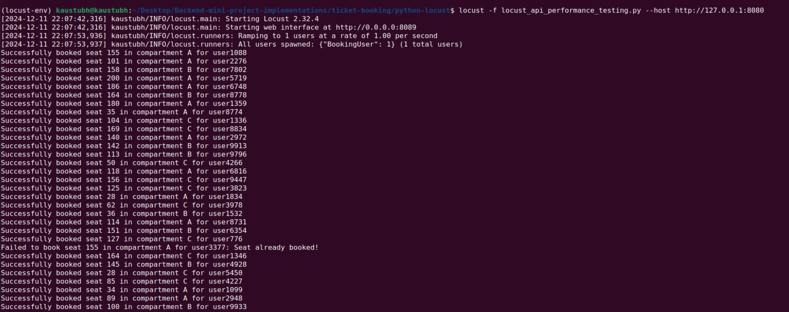
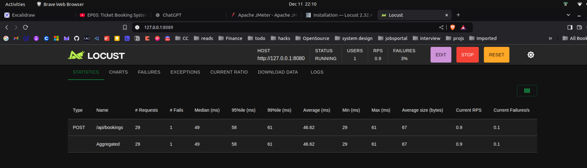

- Created a spring starter data project - 
- Mysql queries to create seats
```sql

```
- juncture 1
- basic code with optimistic locking support by hibernate/spring data jpa
- testing.

Using locust tool by python. 




- using rabbit mq to have scheduled requests queuing to the database.
- caching -for the payment grace period -  redis.